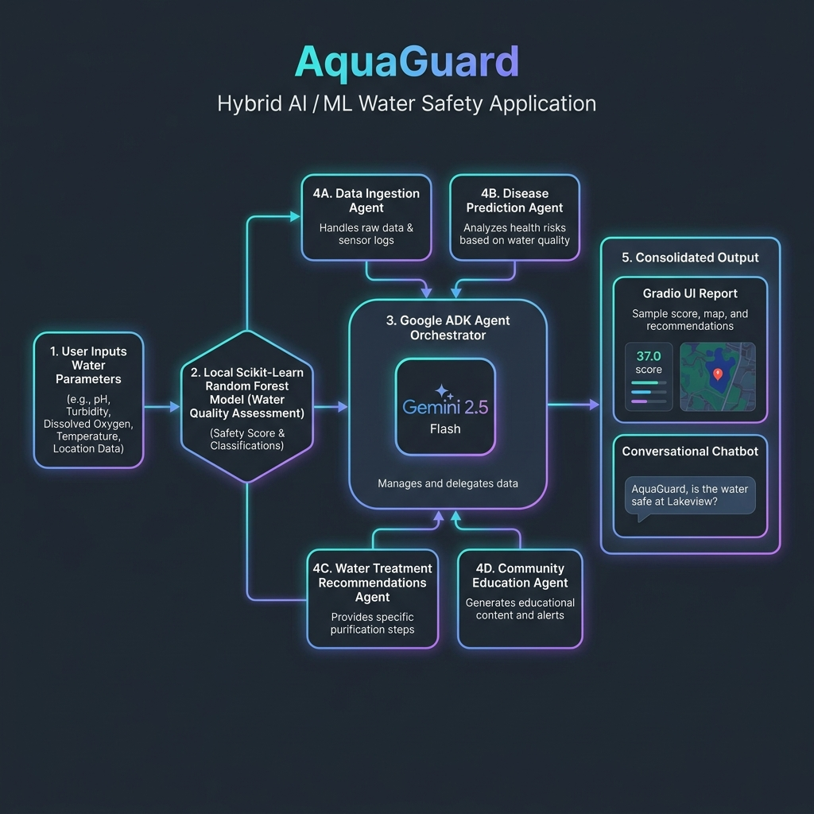

# 🌊 AquaGuard Agent
### AI Multi-Agent System for Community Water Quality Monitoring & Predictive Health Protection

🚀 **Live Demo on Google Cloud Run:** **[https://aquaguard-dashboard-88871271962.us-central1.run.app](https://aquaguard-dashboard-88871271962.us-central1.run.app)**

---

## 📌 Project Overview

**AquaGuard** is a hybrid artificial intelligence and machine learning solution built for the **Kaggle Coding Agents Capstone Project**. It is designed to democratize water quality testing, forecast waterborne disease risks, and deliver actionable purification guidelines. 

The system coordinates a **Google Agent Development Kit (ADK)** multi-agent team with a locally trained **Scikit-learn Random Forest Classifier** to analyze water quality metrics, provide specialized agricultural insights, generate bilingual community posters, and answer questions through a conversational chatbot.

---

## 📐 System Architecture

The pipeline uses a **hybrid ML + LLM agent orchestration** design. When a user submits water chemistry parameters, they are processed in a two-stage pipeline:



---

## 🧠 Multi-Agent Orchestration (Google ADK)

The project instantiates **5 specialized agents** defined in `main.py`:

1. **`orchestrator_agent`** : Coordinates routing. Determines which agents to run based on the user's intent.
2. **`data_ingestion_agent`** : Normalizes inputs and checks values against official WHO drinking water standards.
3. **`prediction_agent`** : Performs disease risk indexing (Cholera, Typhoid, Dysentery, Fluorosis) based on parameter violations.
4. **`recommendation_agent`** : Formulates treatment methods (RO, multi-stage sediment filters, calcite neutralizers) and assesses **crop irrigation suitability** based on salinity tolerances.
5. **`education_agent`** : Writes plain-language explainers and converts raw alerts into print-ready multilingual community posters.

---

## 🧠 Machine Learning Model (Kaggle Dataset)

To ground the system in empirical data, a **Random Forest Classifier** is automatically trained at startup on the Kaggle [Water Potability Dataset](https://www.kaggle.com/datasets/adityakadiwal/water-potability) (3,276 water samples):
- **Outliers & Imputation**: Handles missing parameters using training medians and filters outliers.
- **Training**: Uses 100 decision trees to classify potability.
- **In-Memory Caching**: The model is serialized to disk once and cached in RAM. Subsequent predictions run instantly without disk I/O, decreasing local pipeline latency.
- **Trained Model Metrics**: Prominently displayed to judges and users in the report (demonstrating ~68% accuracy/precision/recall scores).

---

## 🎨 Interactive User Interface (Gradio 6)

The frontend is divided into **four clean, modern utility tabs** built with a dark-slate design system:

1. **🧪 Water & Farm Analyzer**: Unified interface. Move sliders (pH, TDS, Turbidity, etc.) and select crop/season context. Triggers local ML prediction and outputs a combined Safety and Irrigation suitability report.
2. **📢 Community Alert Generator**: Instantly drafts emergency alerts. Generates multilingual flyers (e.g., in Spanish, Hindi, or Swahili) alongside English translations for immediate community distribution.
3. **📚 Water Academy (Conversational Chatbot)**: A responsive `gr.Chatbot` utilizing Gradio 6's bubble layout. Includes clickable suggestion chips to learn about pH, Lead poisoning, or Cholera prevention.
4. **📊 Kaggle Dataset Explorer**: Logs preprocessing statistics, row counts, imputed columns, and outlier counts to demonstrate training transparency.

---

## 🛡️ Security Validation & Cloud Architecture

### 1. Input Sanitization
- All numeric parameters are sanitized through `tools/water_analysis_tool.py::sanitize_inputs`.
- Prevents script/HTML injection, bounds-checks parameters (e.g., pH is capped at `0.0 - 14.0`), and converts missing inputs to `None` for imputation.

### 2. Auto-Credentialing & Production Hiding
- **Local Mode**: If run locally, the dashboard displays a connection accordion allowing users to choose between Google Cloud Vertex AI or Developer API Keys.
- **Production Mode**: When deployed to Cloud Run, the system checks for server-side environment variables (`GOOGLE_CLOUD_PROJECT`). If present, **the connection accordion is hidden from public users**, ensuring the application runs out-of-the-box using the server's resources.

### 3. Serverless Deployment (Google Cloud Run)
- The app runs in a Docker container built via the optimized Dockerfile.
- Utilizes an IAM binding granting the **Vertex AI User** (`roles/aiplatform.user`) role to the Cloud Run service identity service account, securing access to Vertex AI APIs without hardcoded credentials.

---

## 🚀 Setup & Execution

### 1. Installation
Ensure Python 3.10 and `uv` package manager are installed.
```bash
# Synchronize environment and install dependencies
uv sync

# Activate virtual environment (Windows)
.venv\Scripts\activate
# Activate virtual environment (macOS/Linux)
source .venv/bin/activate
```

### 2. Run Locally
```bash
python main.py
```
Open **`http://localhost:7860`** in your browser.

### 3. Build & Run Container (Docker)
```bash
docker build -t aquaguard-agent .
docker run -p 7860:7860 -e PORT=7860 aquaguard-agent
```

---

## 🏆 What I have done

- **🤖 Multi-Agent System (ADK)**: Coordinates 5 specialized agents with sub-agent routing.
- **🧠 Agent Skills**: Boundaries, personas, and communication standards documented in markdown.
- **🛡️ Security Features**: Input sanitization, value range validation, and production credential hiding.
- **🐳 Deployability**: Multi-stage Dockerfile and deployed live on GCP Cloud Run.


> 💡 **Built with ❤️ for the Kaggle x Google AI Agents Capstone**
> 
> *Making clean water accessible through the power of AI agents.*
